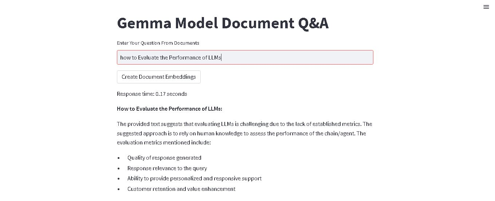

# GROQ Document Chat Bot

The GROQ Document Chat Bot is a project that implements a document-based question answering system using GROQ technology. It allows users to ask questions based on the provided context from a collection of documents and receive accurate responses in real-time. This repository contains the code for the chat bot along with instructions on how to set it up and use it.

## Features

- **Document Embedding:** Utilizes Google Generative AI Embeddings to encode documents into vector representations for efficient retrieval.
- **Streamlit Interface:** Provides a user-friendly web interface powered by Streamlit, allowing users to input questions and receive prompt responses.
- **Response Time Logging:** Logs and displays response times for each query, showcasing the system's efficiency.
- **Document Similarity Search:** Includes a feature for exploring document similarity, enabling users to delve deeper into related content.

## Installation

1. Clone the repository to your local machine:

    ```bash
    git clone https://github.com/yourusername/Document_GROQ_QA.git
    ```

2. Navigate to the project directory:

    ```bash
    cd Document_GROQ_QA

    ```

3. Install the required dependencies using pip:

    ```bash
    pip install -r requirements.txt
    ```

## Usage

1. Ensure you have the necessary API keys configured in a `.env` file. Refer to the `.env.example` file for the required keys.

2. Run the Streamlit app using the following command:

    ```bash
    streamlit run app.py
    ```

3. Access the web interface in your browser by visiting [http://localhost:****](http://localhost:****).

4. Enter your question in the provided text input field and click on "Create Document Embeddings" to initialize the document embedding process.

5. Once the embeddings are created, you can enter your question and click on "Ask" to receive the answer.

6. Additionally, explore the "Document Similarity Search" section to find related content based on the provided context.

## Dependencies

- faiss-cpu
- groq
- langchain-groq
- PyPDF2
- langchain_google_genai
- langchain
- streamlit
- langchain_community
- python-dotenv
- pypdf
- google-cloud-aiplatform>=1.38

## Screenshots



*Caption: The GROQ Document Chat Bot in action, showcasing blazingly fast response times of just 0.17 seconds for user queries.*

